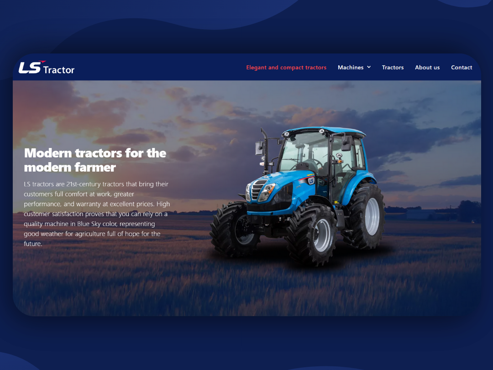
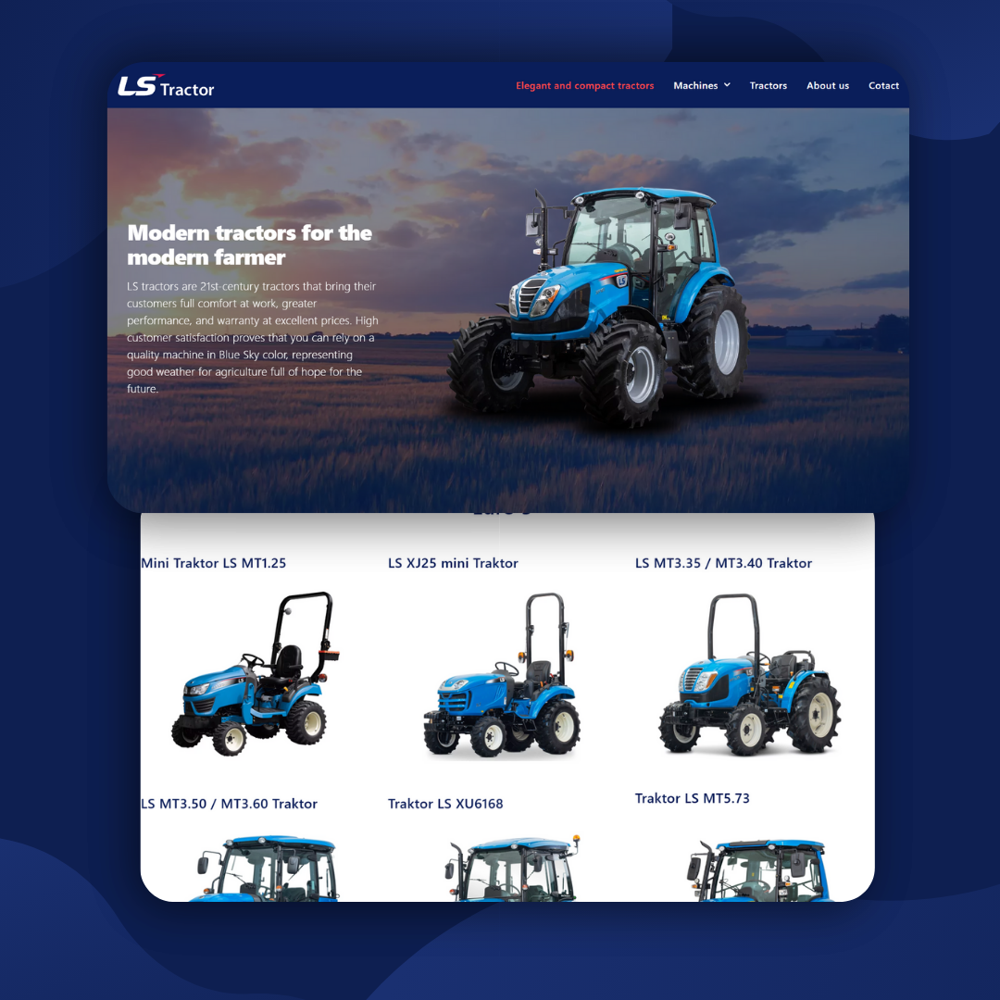
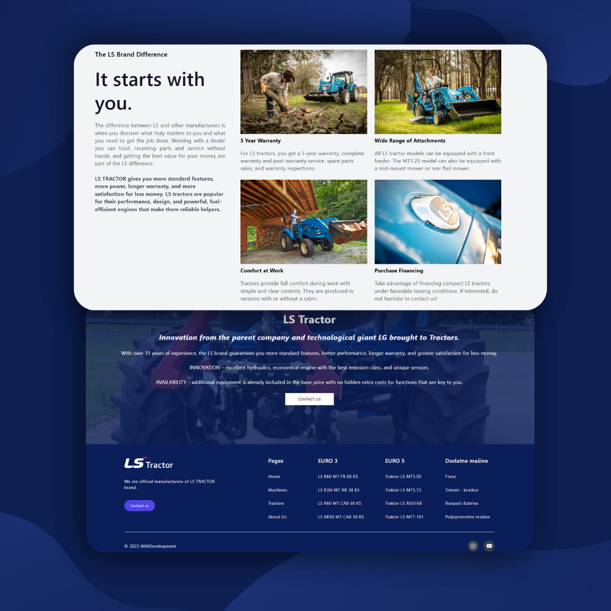

# 🚜 LS Traktors Serbia – Official LS Tractor Distributor Website

Welcome to the official repository for [LS Traktori Srbija](https://lstraktori.rs/) — a custom-built website for **LS Nikolagrar d.o.o.**, the exclusive importer and distributor of **LS Tractor** in Serbia.

This project highlights my capabilities in front-end development, data aggregation, and website optimization for a large-scale business in the agricultural machinery industry.

---

## 🌐 Live Website

👉 **Explore here**: [https://lstraktori.rs/](https://lstraktori.rs/)

---

## 📸 Promotional Previews

These are a few promotional images from the project:

---

## 🧰 Tech Stack

- **HTML5** – Structured the core content and layout.
- **Tailwind CSS** – Used for responsive and modern utility-first styling.
- **Vanilla JavaScript** – Provided interactivity and dynamic rendering without frameworks.

---

## 🧠 Key Highlights & Challenges

### 🔍 Data Scraping & Structuring
One of the most complex parts of this project was **scraping product data** from various online sources. I extracted, cleaned, and converted all relevant product details (specs, pricing, descriptions, etc.) into **structured JSON files**. This made it much easier to populate the website dynamically and ensured consistent formatting.

### 🧱 Static Site, Dynamic Feel
Despite being a statically served site, it offers a smooth and engaging experience. I implemented various JavaScript features to mimic dynamic behavior without relying on heavy frameworks.

---

## 🔧 Ongoing Maintenance

As the company evolves, so does the website. I continue to:

- Add new tractor models and product lines.
- Update specifications, prices, and assets.
- Improve accessibility and responsiveness.

---

## 🙌 A Note from the Developer

This project is a great example of what can be done with a strong foundation in **vanilla web development** and thoughtful data management. I'm proud to contribute to the visibility and success of a major agricultural brand in the region.

If you're interested in working together on a similar project or need help building a fast, reliable, and modern website — feel free to reach out!

